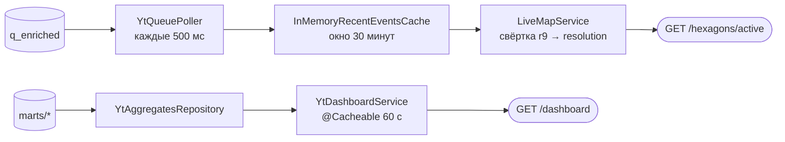

# Бэкенд: устройство REST-сервиса

Spring Boot между кластером YTsaurus и браузером. Отдаёт два экрана —
живую карту и дашборд — тремя эндпоинтами, ничего не пишет в кластер
и не имеет собственной базы.

Место бэкенда в системе — в [overview.md](overview.md), путь данных
до него — в [pipeline.md](pipeline.md), форматы ответов —
в [03-contracts/rest-api.md](../03-contracts/rest-api.md).

## Стек

| Что | Версия | Зачем |
|---|---|---|
| Spring Boot | 4.1.0 | `spring-boot-starter-webmvc`, `-cache`, `-validation` |
| Java | 17 | целевой уровень компиляции |
| `ytsaurus-client` | 1.2.17 | RPC-клиент YTsaurus |
| `h3` (Uber) | 4.1.1 | вся геометрия ячеек |
| Caffeine | из BOM Spring | окно живой карты и кэш дашборда |
| Lombok | из BOM Spring | только `@Slf4j` |

**Spring Boot 4 приносит Jackson 3.** Пакет — `tools.jackson.databind`,
а не `com.fasterxml.jackson.databind`; в `com.fasterxml` остались только
аннотации. Первое, обо что спотыкается любой, кто пишет здесь новый код
с JSON: импорт `ObjectMapper` берётся из `tools.jackson`.

## Слои

```
controller/   биндинг параметров, валидация границы доверия, делегирование
service/      бизнес-логика: свёртка H3, периоды, кэширование ответа
repository/   чтение YTsaurus и кэш свежих событий в памяти
service/poller/  наполнение кэша из очереди
model/, model/dto/  записи домена и записи ответа
error/        типы ошибок и единый обработчик
config/       бины H3Core, Clock, CacheManager
```

Контроллеры тонкие: разбирают параметры, проверяют их и зовут сервис.
Валидация `period` и `limit` живёт в `DashboardController`, а не в
реализациях `DashboardService` — это граница доверия, и дублировать её
в двух реализациях незачем.

## Два пути данных



Разница принципиальная. **Карта не ходит в YT на запрос вообще**: данные
уже лежат в памяти, потому что их положил туда фоновый поллер. Запрос
пользователя стоит одну свёртку по кэшу. **Дашборд ходит в YT**, но
через кэш ответа на 60 секунд, поэтому в кластер уходит не более одного
чтения в минуту на пару `(period, limit)`.

Такое разделение возможно ровно потому, что данные разной природы:
живая карта — это окно последних 30 минут, оно физически помещается
в память; дашборд — агрегаты за месяц, которые считать на лету нельзя,
но и меняются они раз в час.

## Живая карта

### Поллер

`service/poller/YtQueuePoller.java`. Метод `writeCache` вызывается
`@Scheduled(fixedDelayString = "${app.poller.interval-ms:500}")`.

Первый тик после старта вызывает `repository.skipToLatest()` — доходит
до конца очереди и ставит курсор туда. История не перечитывается: кэш
всё равно хранит 30 минут, а перечитывание всей очереди на каждом
рестарте — гарантированный способ положить сервис при первом же
инциденте. Плата за это — после рестарта карта наполняется заново, и
полчаса она беднее обычного.

Дальше каждый тик читает страницами (до 10 страниц по 1000 строк) через
`QEnrichedRepository.fetchAfter`, пока в очереди есть непрочитанное.

Курсор двигается в `finally` — то есть после страницы, независимо от
того, что случилось с отдельными событиями:

```java
try {
    for (EnrichedEvent event : page.events()) consume(event);
} finally {
    lastSeenRowIndex = page.lastRowIndex();
}
```

Причина конкретная: раньше одна битая строка, на которой падал
`cache.put`, оставляла курсор на месте, и поллер вечно перечитывал ту же
страницу — очередь для карты вставала целиком. Сейчас падение одного
события ловится в `consume`, событие отбрасывается и считается в
`droppedEvents`, поток идёт дальше.

Логирование разведено по типам: `YtReadException` — это `warn` и ретрай
на следующем тике, а после пяти неудач подряд (`ytFailStreak`) сообщение
поднимается до `error`; любое другое `RuntimeException` — сразу `error`,
потому что это баг в нас, а не недоступность кластера.

### Кэш свежих событий

`repository/InMemoryRecentEventsCache.java`, интерфейс
`RecentEventsCache`. Гарантии стыка описаны отдельно —
[03-contracts/backend-cache.md](../03-contracts/backend-cache.md), —
здесь только устройство.

- `ConcurrentHashMap<String, Deque<EnrichedEvent>>`: ключ — `h3_r9`, как
  пришёл из очереди, значение — `ConcurrentLinkedDeque`, новые события
  добавляются в начало;
- дедуп — отдельный Caffeine-кэш `seen` с `expireAfterWrite`, равным
  окну. Повторно приехавший `event_id` не создаёт второй записи. Именно
  это делает безопасной повторную доставку из очереди;
- окно считается по `event_ts` — времени самой правки, а не времени
  чтения. Отставание пайплайна видно честно: если обогащение встало,
  карта пустеет, а не показывает старое как свежее;
- события без времени и «из будущего» дальше чем на `CLOCK_SKEW_SECONDS`
  (60 с) отбрасываются с записью в лог: по ним нельзя посчитать окно,
  и они либо не покажутся никогда, либо не протухнут никогда;
- `snapshot()` собирает иммутабельную копию, отфильтровав протухшее и
  отсортировав каждую ячейку по времени;
- `@Scheduled(fixedDelay = 60_000)` раз в минуту чистит деки. Пустые
  ячейки из мапы не удаляются — их отсеивает `snapshot`.

Потолка по размеру нет: размер ограничивает само окно. Задавать лимит
до первого живого замера значило бы настраивать под неизмеренную
нагрузку.

### Сборка ответа

`service/LiveMapService.java`, метод `active`:

1. проверка входа: `min` строго меньше `max` по обеим осям, `zoom`
   в диапазоне `app.live.zoom-min…zoom-max`;
2. `zoom` → резолюция H3 (`H3GeoService.resolutionZoom`);
3. `cache.snapshot()` — весь снимок окна;
4. каждый ключ r9 сворачивается вверх до целевой резолюции
   (`cellToParent`); невалидный ключ логируется и пропускается, а не
   роняет запрос;
5. ячейки, не пересекающиеся с экраном, отбрасываются;
6. для оставшихся собирается `HexagonDto`.

Свёртка идёт **вверх**, а не вниз, и это не мелочь: разворот запрошенной
ячейки r3 в дочерние r9 дал бы около 117 тысяч ключей на одну ячейку.
Поэтому кэш читается снимком целиком, а не по ключам.

`events_count` — размер ячейки **до** обрезки, а `events` — не более
`app.live.hexagon-events-cap` (50) самых свежих правок. Правок в одной
ячейке могут быть тысячи; хранить и отдавать их все дорого и незачем,
а счётчик всё равно показывает настоящее число. Сортировка стоит **до**
`limit`, иначе в ответ попали бы первые 50 из конкатенации отсортированных
кусков, а не 50 самых свежих.

### Почему H3 считается на сервере

Альтернатива — отдавать фронту координаты и просить SDK карты
самостоятельно строить сетку. Выбран сервер, и вот почему это не
вкусовщина:

- **один источник правды.** Пайплайн кладёт в очередь `h3_r9`, витрины
  агрегируют по H3, кэш хранит ключом H3. Если бы сетку строил клиент,
  та же логика существовала бы в двух местах и на двух языках;
- **независимость от карты.** Контракт — строка `h3_index`. Замена
  Яндекс.Карт на MapLibre не трогает бэкенд вообще;
- **тестируемость.** `curl` → JSON, без браузера и без отрисовки;
- **стоимость.** Свёртка — арифметика над 64-битными числами, миллисекунды;
  на клиенте она повторялась бы у каждого пользователя.

Лестница зума живёт в `application.yaml` и читается `H3GeoService`:

| Зум | Резолюция | Ключ конфигурации |
|---|---|---|
| ≤ 6 | 3 | `zoom-r3-max: 6` |
| 7 | 4 | `zoom-r4-max: 7` |
| 8–9 | 5 | `zoom-r5-max: 9` |
| 10–11 | 6 | `zoom-r6-max: 11` |
| 12–13 | 8 | `zoom-r8-max: 13` |
| ≥ 14 | 9 | — |

Ступени r7 в лестнице нет: после r6 идёт сразу r8, и ключа
`zoom-r7-max` не существует. `zoom-min: 0` — карта начинается с нуля,
весь мир; `zoom-max: 30` — потолок.

### Пересечение ячейки с экраном

`H3GeoService.intersectsBbox` проверяет три условия, а не одно:

- центр ячейки внутри прямоугольника;
- любая из шести вершин внутри прямоугольника;
- любой из четырёх углов прямоугольника попадает в эту ячейку.

Наивная проверка «центр внутри экрана» на низком зуме даёт дыры по краям
карты: ячейка r3 крупнее экрана, её центр за кадром, и она не рисуется,
хотя занимает пол-экрана. Третье условие ловит ровно этот случай.

## Дашборд

`service/YtDashboardService.java` (профиль `yt`),
`repository/YtAggregatesRepository.java`.

Наружу периоды читаемые — `24h`, `7d`, `30d`, — а витрины хранят период
строкой в часах, поэтому сервис переводит: `7d` → `168h`, `30d` → `720h`.
Перевод живёт на бэкенде, таблицы на кластере из-за него не меняются.

Для `30d` 720 часовых точек сворачиваются в 30 суточных: месяц
почасовыми точками — это шум, а не график. `total_edits` считается уже
по свёрнутым точкам, поэтому сумма всегда сходится с тем, что нарисовано.

Ответ кэшируется целиком: `@Cacheable("dashboard")`, ключ — пара
`(period, limit)`, Caffeine с `expireAfterWrite(60, SECONDS)`
(`config/CacheConfig.java`). Кэшируется именно ответ, а не вызовы
репозитория — иначе свёртка 720 точек повторялась бы на каждый запрос.
Побочная выгода: три витрины попадают в кэш одним снимком, и блоки
ответа гарантированно относятся к одному чтению. Подробности —
[03-contracts/dashboard-cache.md](../03-contracts/dashboard-cache.md).

Исключения не кэшируются: при недоступности кластера следующий запрос
пойдёт в YT заново, а пользователь получит 503, а не вчерашние цифры
без пометки.

### Чтение витрин

Запросы к YT собираются строкой и уходят через `SelectRowsRequest`:

```sql
title, url, edits_count FROM [{marts/top_articles}]
WHERE period = "24h" ORDER BY rank LIMIT 10
```

Витрины — сортированные динамические таблицы с ключом `(period, rank)`,
поэтому такой запрос не сканирует таблицу целиком.

Всё, что попадает в текст запроса, проверяется до сборки строки:
`period` — регулярным выражением `^\d+h$`, `limit` — зажимается в
`1…1000`. Параметризованной подстановки здесь нет, поэтому проверка
обязательна, а не желательна: она и есть защита от подстановки чужого
текста в запрос.

Лимит по умолчанию для `trends` — 1000 точек, чуть выше 720 часов
самого длинного окна.

## Ошибки

`error/GlobalExceptionHandler.java` — `@RestControllerAdvice`,
унаследованный от `ResponseEntityExceptionHandler`.

Наследование здесь несущее, а не декоративное. `@ExceptionHandler(Exception.class)`
в `@RestControllerAdvice` перехватывает и стандартные исключения Spring
MVC, поэтому без родителя 500 отдавались не только на ошибках биндинга,
но и на 404 (неизвестный путь) и 405. Родитель объявляет обработчики
для этих типов точнее, `ExceptionDepthComparator` выбирает их, и
catch-all остаётся только для действительно неожиданного.

| Исключение | Статус | Что видит клиент | Что уходит в лог |
|---|---|---|---|
| `BadRequestException` | 400 | наш собственный текст («period must be one of 24h, 7d, 30d») | — |
| `YtReadException` | 503 | `storage is temporarily unavailable` | полный стек с путём таблицы |
| прочее | 500 | `internal error` | полный стек |
| ошибки биндинга, 404, 405 | 4xx | обработка Spring MVC | — |

Формат — Problem Details (`spring.mvc.problemdetails.enabled: true`).
Наружу из ошибок YT уходит статичный текст: путь таблицы и сообщение
кластера остаются в логе. В сообщении об ошибке чтения нет ничего
полезного клиенту и есть кое-что полезное чужому.

## Конфигурация

`backend/src/main/resources/application.yaml`. Ноль хардкода: всё, что
может понадобиться подкрутить, — ключ в yaml.

| Ключ | Значение | Что делает |
|---|---|---|
| `spring.profiles.default` | `yt` | боевой профиль по умолчанию |
| `spring.jackson.property-naming-strategy` | `SNAKE_CASE` | превращает поля записей в `snake_case` контракта |
| `spring.task.scheduling.pool.size` | 2 | пул для `@Scheduled` |
| `app.live.window-minutes` | 30 | окно живой карты |
| `app.live.zoom-min` / `zoom-max` | 0 / 30 | допустимый зум |
| `app.live.zoom-r*-max` | 6/7/9/11/13 | лестница зум → резолюция |
| `app.live.hexagon-events-cap` | 50 | максимум событий в одном гексагоне |
| `app.poller.interval-ms` | 500 | тик поллера |
| `app.poller.max-pages-per-tick` | 10 | сколько страниц вычитывать за тик |
| `app.ymaps.api-key` | `${YMAPS_API_KEY:}` | отдаётся фронту через `/api/v1/config` |
| `yt.proxy`, `yt.token` | из окружения, обязательны | подключение к кластеру |
| `yt.base-path` | `${YT_BASE_PATH://home/wikipulse}` | корень всех путей |
| `yt.table.*` | `${yt.base-path}/…` | пути таблиц, литералов в коде нет |

**`SNAKE_CASE` трогать нельзя.** Это единственное, что превращает записи
с camelCase-полями в snake_case контракта REST API. Убрать ключ — молча
сломать фронт: ответы останутся валидным JSON, просто с другими именами
полей.

**Пул планировщика равен 2 — ровно по числу задач.** На профиле `yt` их
две (`YtQueuePoller.writeCache`, `InMemoryRecentEventsCache.evictExpired`),
на профиле `mock` тоже две (`MockPoller.emit` и то же вытеснение).
Третья `@Scheduled`-задача потребует увеличить пул, иначе она будет
ждать освобождения потока.

**Тестовый `application.yaml` затеняет основной, а не дополняет его.**
Spring резолвит `classpath:/application.yaml` в один-единственный ресурс,
а `test-classes` стоит в classpath раньше. Отсюда продублированный блок
`spring.*` в `backend/src/test/resources/application.yaml`, в частности
тот самый `property-naming-strategy: SNAKE_CASE` — без него тесты
проверяли бы camelCase вместо контракта. Правило: **добавил в основной
yaml ключ, важный для тестов, — продублируй в тестовый.**

## Профиль mock

Профиль `mock` показывает продукт целиком без кластера. `@Profile("yt")`
стоит на репозиториях, поллере и `YtDashboardService`; контроллеры от
профиля не зависят вообще, поэтому контракт API одинаков в обоих режимах.

| Профиль `yt` | Профиль `mock` |
|---|---|
| `QEnrichedRepository`, `YtQueuePoller` | `MockPoller` |
| `YtAggregatesRepository`, `YtDashboardService` | `MockDashboardService` |

Данные — настоящие, снятые с боевого стенда через публичный API:
`backend/src/main/resources/fixtures/q_enriched-sample.json` (730 правок)
и `dashboard-{24h,7d,30d}.json`. `MockDashboardService` читает фикстуры
при старте и обрезает топы под запрошенный `limit`.

`MockPoller` устроен интереснее, чем «генератор случайных событий»:

- **`@PostConstruct backfill`** сдвигает всю выборку так, чтобы последняя
  правка легла ровно на `now`. Окно снапшота (около 30 минут) совпадает
  с окном живой карты, и форкер видит полную карту сразу, а не пустую
  на полчаса;
- **`@Scheduled(fixedDelay = 2_000) emit`** гоняет тот же список по кругу
  с текущим временем. К `event_id` повторного прохода дописывается `#N`,
  иначе дедуп по `event_id` отбросил бы повтор. Полный круг из 730
  событий по 2 секунды — около 24 минут, то есть короче окна дедупа
  в 30 минут, и без суффикса карта замерла бы;
- **ячейки синтетические.** Координат правок у mock нет: `dict/coords`
  через публичный API недоступен. Поэтому ячейка назначается по хешу
  языкового раздела поверх настоящих `h3_parent` из `dashboard-24h.json`.
  Правка настоящая, ячейка настоящая, связь между ними — нет. Это надо
  знать, прежде чем делать выводы по mock-карте о географии правок.

## Известные ограничения

Честный список того, что в бэкенде сделано просто и где у этого потолок:

1. **Одна реплика.** Кэш живой карты и курсор поллера живут в памяти
   процесса. Вторая реплика будет читать очередь независимо и держать
   свою копию окна: ответы разойдутся, а нагрузка на очередь удвоится.
2. **Очередь читается `select_rows`, а не consumer API.** Курсор не
   переживает рестарт, читается только нулевой таблет
   (`[$tablet_index] = 0`), бэкенд не участвует в `auto_trim`. Разбор —
   в [pipeline.md](pipeline.md).
3. **Свёртка идёт по всему снимку на каждый запрос.** Кэшируется окно,
   но не результат свёртки: два пользователя с одинаковым зумом и
   экраном оплачивают её дважды. Пока ячеек в окне тысячи, это дешевле
   инвалидации кэша по `(zoom, bbox)`.
4. **Экран через 180-й меридиан не поддерживается.** Валидация требует
   `min_lng < max_lng`, так что viewport через антимеридиан получит 400.
5. **Текст ошибки про зум зашит константой** (`zoom must be between
   0 and 30`), хотя границы конфигурируемы. Поменяв `zoom-max`, придётся
   поменять и сообщение.
6. **У каждого репозитория свой `YTsaurusClient`.** Два подключения к
   одному кластеру там, где хватило бы одного бина.
