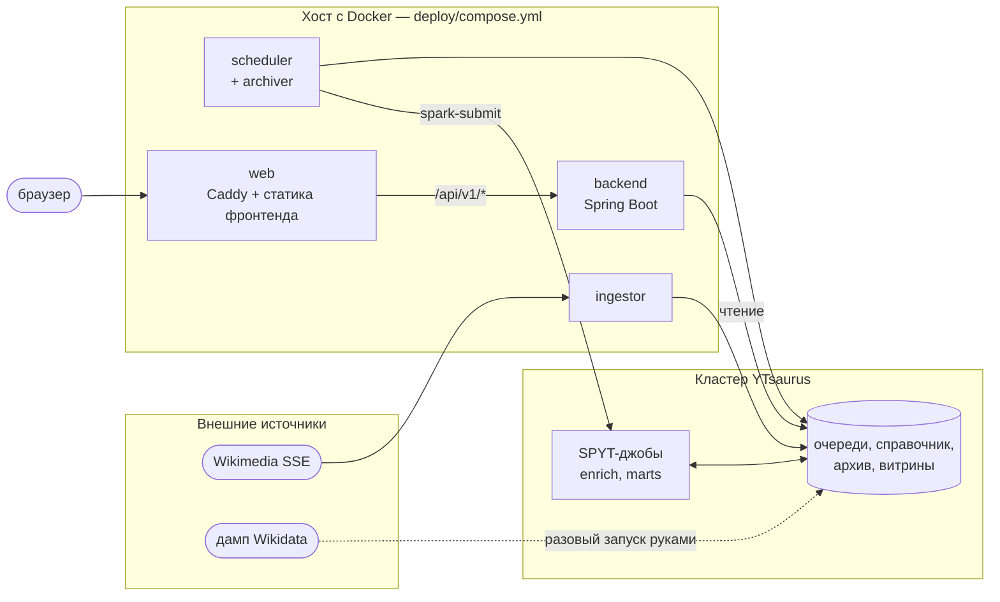

# Обзор: компоненты и границы между ними

WikiPulse показывает правки Википедии на карте в реальном времени и
считает по ним историческую аналитику. Хранилище, вычисления и очереди —
YTsaurus; всё остальное вокруг него.

Этот документ отвечает на вопрос «из чего система состоит и кто с кем
разговаривает». Как данные текут и что будет при падении звена —
в [pipeline.md](pipeline.md). Внутреннее устройство REST-сервиса —
в [backend.md](backend.md).

## Компоненты



| Компонент | Каталог | Где выполняется | Роль |
|---|---|---|---|
| `ingestor` | `bigdata/` | контейнер на хосте | поток правок Википедии → очередь `q_raw` |
| `spyt_enrich` | `bigdata/` | операция на кластере | обогащение координатами, `q_raw` → `q_enriched` |
| `archiver` | `bigdata/` | подпроцесс шедулера | `q_enriched` → архив `history/t_history` |
| `spyt_marts` | `bigdata/` | операция на кластере | архив → витрины `marts/*` |
| `scheduler` | `bigdata/` | контейнер на хосте | запускает архиватор и витрины по расписанию |
| `backend` | `backend/` | контейнер на хосте | читает `q_enriched` и витрины, отдаёт REST |
| `frontend` | `frontend/` | браузер | карта и дашборд |
| `web` | `deploy/` | контейнер на хосте | Caddy: TLS, статика, прокси `/api` на бэкенд |

Разовые скрипты (`init-tables`, `upload-artifacts`,
`load-dict-coords-full`) живут там же, в `bigdata/`, но запускаются
руками при развёртывании, а не постоянно.

## Три границы

Границ, которые нужно держать в голове, ровно три. Всё остальное —
внутренние детали компонентов.

### 1. Пайплайн ↔ бэкенд: таблицы YTsaurus

Единственный способ, которым данные пайплайна попадают в сервис —
таблицы. Никаких HTTP-вызовов, очередей сообщений или общей базы между
ними нет: пайплайн пишет, бэкенд читает.

| Объект | Пишет | Читает |
|---|---|---|
| `{BASE}/q_enriched` | `spyt_enrich` | backend, `archiver` |
| `{BASE}/marts/trends` | `spyt_marts` | backend |
| `{BASE}/marts/top_articles` | `spyt_marts` | backend |
| `{BASE}/marts/top_geo` | `spyt_marts` | backend |

Схемы и гарантии — [03-contracts/yt-schemas.md](../03-contracts/yt-schemas.md).
Контракт меняется с согласия обеих сторон; расхождение кода с ним —
баг кода, а не документа.

Следствие такой границы: бэкенд можно перезапускать, переписывать и
масштабировать, не трогая кластер, а пайплайн разрабатывать, не поднимая
Spring. Обратная сторона — у них нет общей типизации, и совпадение
имён колонок проверяется только этим контрактом.

### 2. Бэкенд ↔ фронтенд: REST `/api/v1`

Три эндпоинта, JSON, поля в `snake_case`:

| Эндпоинт | Кто зовёт | Как часто |
|---|---|---|
| `GET /api/v1/hexagons/active` | карта | поллинг раз в 2,5 с |
| `GET /api/v1/dashboard` | дашборд | при открытии и смене периода |
| `GET /api/v1/config` | оболочка приложения | один раз при загрузке |

Форматы — [03-contracts/rest-api.md](../03-contracts/rest-api.md).

Через `/api/v1/config` фронт получает ключ Яндекс.Карт. В бандл ключ
не собирается: у его доставки ровно одна точка входа, и смена ключа —
это перезапуск бэкенда с другим `YMAPS_API_KEY`, а не пересборка
фронтенда. Пустой ключ допустим — тогда фронт показывает экран ошибки
карты, а всё остальное приложение работает.

Вся геометрия H3 остаётся на сервере: фронт получает готовые индексы
ячеек и рисует их. Почему так — в [backend.md](backend.md), раздел
«Почему H3 считается на сервере».

### 3. Всё ↔ кластер: `YT_BASE_PATH`

Ни в бэкенде, ни в пайплайне нет литеральных путей к таблицам. Корень
задаётся переменной `YT_BASE_PATH` (по умолчанию `//home/wikipulse`),
и от него строится всё остальное — в одном месте на модуль:

- пайплайн: `bigdata/src/bigdata/paths.py`;
- бэкенд: ключ `yt.base-path` в `application.yaml`, остальные пути через
  `${yt.base-path}/…`.

Форк проекта — это одна переменная окружения. До приведения репозитория
в такой вид литерал боевого стенда был вписан в семь модулей пайплайна.

## Переменные окружения

| Переменная | Кто читает | Обязательна | По умолчанию |
|---|---|---|---|
| `YT_PROXY` | backend, bigdata | да | — |
| `YT_TOKEN` | backend, bigdata | да | — |
| `YT_BASE_PATH` | backend, bigdata | нет | `//home/wikipulse` |
| `YMAPS_API_KEY` | backend | нет | пусто (фронт покажет экран ошибки) |
| `WIKIPULSE_CONTACT` | bigdata | нет | канонический URL проекта |
| `DOMAIN`, `ACME_EMAIL` | deploy | да | — |

Джобы на кластере токен из окружения контейнера не получают: YTsaurus
кладёт им `YT_SECURE_VAULT_YT_TOKEN` в окружение операции сам.

## Два профиля бэкенда

| Профиль | Источник данных | Зачем |
|---|---|---|
| `yt` (по умолчанию) | кластер | боевой режим |
| `mock` | фикстуры в `backend/src/main/resources/fixtures/` | продукт целиком без кластера |

Профиль `mock` — не заглушка с выдуманными числами. Живая карта крутит
730 настоящих правок Википедии, дашборд отдаёт три настоящие витрины,
снятые с боевого стенда через публичный API. Форкер видит работающий
продукт до того, как получит доступ к кластеру. Что в этих данных
синтетическое и почему — в [backend.md](backend.md), раздел «Профиль mock».

## Где что лежит

```
backend/     Spring Boot: REST, поллер очереди, кэш живой карты
bigdata/     python-пакет: ингестор, SPYT-джобы, архиватор, шедулер, скрипты
frontend/    React + Vite: карта и дашборд
deploy/      compose.yml, Dockerfile'ы, конфигурация Caddy
docs/        эта документация
setup/       настройка окружения SPYT
```

Каждый модуль несёт свой `README.md` — как его собрать и запустить, —
а «почему сделано именно так» живёт в документах этого раздела. В коде
комментариев нет: любое объяснение решения привязано к файлу и символу
в соответствующем документе (`bigdata/implementation-notes.md`,
[frontend-implementation-notes.md](frontend-implementation-notes.md)).

## Что осталось за кадром

Честный список того, чего в примере нет и делать вид, что есть, не надо:

- **метрик и трассировки.** Наблюдаемость держится на логах и на
  атрибутах витрин (`@computed_at`). Для продакшена этого мало;
- **аутентификации.** API публичное и только на чтение;
- **горизонтального масштабирования бэкенда.** Кэш живой карты и курсор
  поллера живут в памяти процесса, поэтому вторая реплика будет читать
  очередь независимо и держать свою копию окна;
- **реестра образов.** Образы собираются на боевой машине; правильный
  вариант через GHCR описан в `deploy/README.md`.
