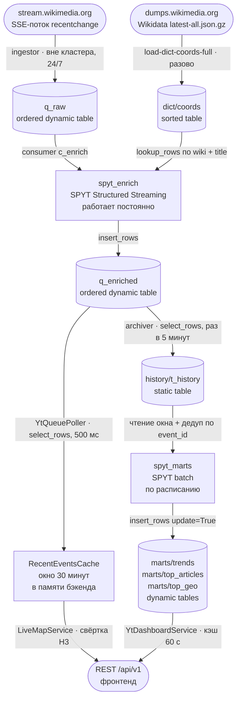

# Пайплайн: от потока правок Википедии до витрин

Главный документ репозитория. WikiPulse существует как пример того, как
собрать сервис поверх YTsaurus: живая карта правок Википедии и дашборд
исторической аналитики. Здесь описано, что именно происходит с данными,
какой примитив YTsaurus взят на каждом шаге и почему, и что будет, если
звено упадёт.

Документ описывает фактическое состояние кода. Наивные места названы
наивными: где сделано упрощение, там сказано, в чём его потолок и как
выглядит правильный вариант. Схемы таблиц — в
[03-contracts/yt-schemas.md](../03-contracts/yt-schemas.md), устройство
REST-сервиса — в [backend.md](backend.md), состав компонентов —
в [overview.md](overview.md).

## Поток данных целиком



Две ветки после `q_enriched` независимы: живая карта не ждёт архиватора,
дашборд не зависит от бэкенда. Очередь — единственная точка их встречи.

## Сквозной ключ: `event_id`

Всё дальнейшее держится на одном решении. Ингестор собирает идентификатор
как `{wiki}|{revision.new}` — языковой раздел и номер ревизии
(`bigdata/src/bigdata/jobs/ingestor.py`, `event_to_row`). Номер ревизии
в Википедии уникален и неизменен, поэтому одна и та же правка получает
один и тот же `event_id` при любом количестве повторных доставок.

Это то, что делает безопасной семантику at-least-once на всех стыках:
повторно приехавшая строка не портит результат ни в кэше живой карты
(дедуп по `event_id`), ни в витринах (`dropDuplicates(["event_id"])`).
Без такого ключа at-least-once пришлось бы менять на что-то дороже.

## Шаг 1. SSE → `q_raw`

Файл: `bigdata/src/bigdata/jobs/ingestor.py`. Обычный python-процесс,
на кластере не выполняется, в `deploy/compose.yml` — сервис `ingestor`.
Работает постоянно.

Читает поток `https://stream.wikimedia.org/v2/stream/recentchange`,
отбрасывает всё, что не правка статьи: ботов, служебные вики
(`wikidatawiki`, `commonswiki`, `metawiki`, `abstractwiki`), пространства
имён кроме нулевого, типы событий кроме `edit` и `new`. Заголовок
нормализуется (`_` → пробел) — по нему потом идёт join со справочником.
User-Agent собирается из `WIKIPULSE_CONTACT`: у Wikimedia это требование
их User-Agent policy, а не косметика.

Копит батч из 100 строк и пишет его одним
`yt.insert_rows(q_raw, batch, durability="sync")`.

**Примитив: очередь (ordered dynamic table).** Почему именно она:

- поток append-only, ключа у события нет и не нужен — сортированная
  динамическая таблица заставила бы придумывать ключ и платить за
  read-modify-write там, где нужна только запись в конец;
- читатели независимы: каждый идёт по своему смещению и не мешает
  остальным. У `q_raw` читатель сегодня один, а у `q_enriched` их уже
  два — бэкенд и архиватор, — и добавление третьего ничего не сломает;
- запись сразу видна читателю, в отличие от статической таблицы, где
  данные появляются только после закрытия транзакции записи;
- очередь умеет `auto_trim` — ретеншен как свойство объекта, а не как
  отдельная джоба-чистильщик.

`durability="sync"` — подтверждение только после записи в лог. Батч в 100
строк уже амортизирует стоимость похода в кластер, а терять правки
на ровном месте незачем.

**Что здесь наивно.** `Last-Event-ID` хранится в памяти процесса. Обрыв
самого SSE-соединения переживается корректно — реконнект идёт с этим
заголовком, — но перезапуск процесса начинает чтение с текущего конца
потока, и правки за время простоя не приезжают. Ещё до 99 строк могут
лежать в несброшенном батче. Правильный вариант — держать `Last-Event-ID`
в атрибуте Cypress рядом с очередью и сбрасывать батч по таймеру, а не
только по размеру.

## Шаг 2. Справочник координат: дамп Wikidata → `dict/coords`

Файл: `bigdata/src/bigdata/scripts/load_dict_coords_full.py`. Разовый
(точнее, редкий — по мере устаревания дампа) запуск руками, не по
расписанию.

Стримит `latest-all.json.gz` не распаковывая на диск, отбирает сущности
с координатами (`P625`) и разворачивает их sitelinks в строки
`(wiki, title, lat, lon)`. Пишет во временную таблицу `dict/coords_tmp`
батчами по 50 000 строк, затем сортирует её операцией на кластере
(`yt.run_sort`) в `dict/coords` и удаляет временную.

**Примитив: статическая таблица, отсортированная по (wiki, title).**
Справочник — снимок, а не поток: он целиком пересоздаётся раз в
несколько недель и между пересозданиями не меняется. Сортировка нужна
не сама по себе, а как условие точечного чтения по ключу join.

Сортировка делается операцией YTsaurus, а не клиентом: несколько
миллионов строк на драйвере сортировать нечем, а `run_sort` — обычная
map-reduce операция кластера.

**Известный разрыв, который надо закрыть руками.** `init_tables` заводит
`dict/coords` статической, загрузчик оставляет её статической, а
`spyt_enrich` читает её через `lookup_rows` — а `lookup_rows` работает
только со смонтированной динамической таблицей. Недостающий шаг
(`alter_table(dynamic=True)` плюс `mount_table`) в скрипт не зашит
намеренно: конверсия требует `unique_keys` в схеме, то есть уникальности
пар `(wiki, title)` на реальном дампе, а проверить это без кластера
нельзя. Подробности — `bigdata/implementation-notes.md`, раздел
`paths.py / DICT_COORDS`. Это первое, обо что споткнётся форкер, поэтому
шаг вынесен в `bigdata/README.md` отдельным пунктом.

## Шаг 3. `q_raw` + `dict/coords` → `q_enriched`

Файл: `bigdata/src/bigdata/jobs/spyt_enrich.py`. SPYT Structured
Streaming, запускается `spark-submit --deploy-mode cluster` и работает
постоянно, пока её не остановить. В `compose.yml` её нет: это операция
на кластере, а не контейнер.

```python
raw_stream = (
    spark.readStream
    .format("yt")
    .option("consumer_path", paths.CONSUMER_ENRICH)
    .load(paths.Q_RAW)
)
```

Здесь очередь читается **правильно** — через зарегистрированного
консьюмера `consumers/c_enrich`. Смещения коммитит Spark: контрольная
точка лежит в Cypress по пути `{BASE}/checkpoints/c_enrich`
(`option("checkpointLocation", ...)`). Триггер — 5 секунд.

Каждый микробатч попадает в `foreachBatch(enrich_batch)`, где:

1. батч собирается на драйвер (`batch_df.collect()`);
2. по парам `(wiki, title)` идёт `client.lookup_rows(dict/coords, keys)` —
   точечное чтение по ключу сортированной таблицы;
3. для найденных координат считается ячейка H3 уровня 9
   (`h3.latlng_to_cell(lat, lon, 9)`);
4. результат пишется в `q_enriched` кусками по 50 000 строк.

**Почему join сделан через `lookup_rows`, а не через Spark-join.**
Справочник — многомиллионная таблица, а микробатч — сотни строк за
5 секунд. Полный join сканировал бы справочник ради нескольких сотен
попаданий. Точечное чтение по ключу — ровно тот случай, для которого
у YTsaurus есть `lookup_rows`: сортированная таблица работает как
key-value хранилище, стоимость запроса зависит от числа ключей,
а не от размера таблицы.

**Почему H3 считается здесь, а не позже.** В очередь кладётся уже готовый
`h3_r9`, а не пара `lat/lon`. Ячейка любой более крупной резолюции
получается из r9 чистой арифметикой (`cellToParent`), поэтому одного
уровня хватает и карте, и витринам, и никто ниже по потоку не обязан
уметь геометрию. Обратное — хранить координаты и считать ячейки на
каждом чтении — размазало бы одну и ту же логику по бэкенду и по джобе
витрин.

**Join семантически inner.** Правка статьи без координат в Wikidata
в `q_enriched` не попадает вообще. Джоба печатает hit rate каждого батча —
это единственный способ заметить, что справочник устарел или не
смонтирован.

**Что здесь наивно — главное упрощение пайплайна.** Вся работа делается
на драйвере: `collect()` тянет батч в одну JVM, `lookup_rows` и
`insert_rows` идут оттуда же, executor'ы только читают очередь.
Потолок — пропускная способность одного процесса; на потоке Википедии
(порядка сотен правок в секунду после фильтров) этого хватает, на
потоке в десять раз плотнее — уже нет.

Правильный вариант выглядит так: справочник (или его актуальная
подвыборка) раздаётся broadcast-джойном либо читается
`mapPartitions`/`pandas_udf` по одному соединению на партицию, H3
считается там же на executor'ах, запись идёт распределённо через
`write.format("yt")`. Здесь это не сделано сознательно: проверить такой
код без кластера невозможно, а непроверенный Spark-код в примере
для чужих глаз хуже честно описанного наивного.

**Обработки ошибок внутри `foreachBatch` намеренно нет.** Spark считает
батч успешным, если функция вернула управление без исключения, и
коммитит смещения. Любой `try/except ... return` здесь означал бы, что
при ошибке YTsaurus батч тихо помечается обработанным, а события
пропадают навсегда. Сейчас исключение вылетает, батч не коммитится,
Spark повторяет его сам — это и даёт at-least-once на этом стыке. Цена:
устойчивая ошибка YT останавливает стрим целиком. Выбор в пользу
«шумно упасть» против «тихо потерять».

## Шаг 4a. `q_enriched` → живая карта

Файлы: `backend/.../repository/QEnrichedRepository.java`,
`backend/.../service/poller/YtQueuePoller.java`. Работает постоянно
внутри бэкенда, тик каждые 500 мс (`app.poller.interval-ms`).

Поллер читает страницами по 1000 строк, до 10 страниц за тик, и кладёт
события в `RecentEventsCache` — окно в 30 минут в памяти процесса.
Дальше карта строится уже из кэша, без обращений к YT: подробности —
в [backend.md](backend.md).

**Что здесь наивно — второе главное упрощение.** Очередь читается не
консьюмером, а обычным `select_rows`:

```sql
* FROM [{q_enriched}] WHERE [$tablet_index] = 0 AND [$row_index] > {cursor} LIMIT {n}
```

`$row_index` и `$tablet_index` — служебные колонки упорядоченной
динамической таблицы, так что запрос честно даёт «всё, что появилось
после курсора». Но курсор живёт в памяти поллера, а не в Cypress.
Следствия, каждое из которых видно в коде:

- **после рестарта карта пуста.** Первый тик вызывает
  `skipToLatest()` — доходит до конца очереди и начинает оттуда. История
  не перечитывается: она всё равно не нужна окну в 30 минут, но график
  наполняется заново, и полчаса карта беднее обычного;
- **бэкенд не участвует в ретеншене.** `auto_trim` ориентируется на
  консьюмеров; читатель без консьюмера для очереди невидим, и его
  прогресс на трим не влияет;
- **читается только нулевой таблет.** Условие `[$tablet_index] = 0`
  зашито в запрос. Пока таблет один (а `init_tables` создаёт таблицу
  с одним), это ничего не меняет; при репартиционировании очереди часть
  событий пропадёт из карты молча.

Правильный вариант: свой зарегистрированный консьюмер на реплику
бэкенда, чтение через `pull_consumer`, подтверждение через
`advance_consumer`. Тогда смещение переживает рестарт, читаются все
таблеты, и бэкенд честно держит трим. На consumer API бэкенд не
переведён по той же причине, что и enrich: без кластера это не
проверяется.

**Курсор двигается в `finally`, а не после успешной обработки:**

```java
try {
    for (EnrichedEvent event : page.events()) consume(event);
} finally {
    lastSeenRowIndex = page.lastRowIndex();
}
```

Это осознанный размен. Раньше одна битая строка, на которой падал
`cache.put`, оставляла курсор на месте, и поллер вечно перечитывал ту же
страницу — очередь для карты вставала целиком. Теперь падение отдельного
события ловится в `consume`, событие теряется и считается в
`droppedEvents`, а поток идёт дальше. То есть на этом стыке семантика
не at-least-once, а at-most-once — и это допустимо ровно потому, что
ветка живой карты необязательна: то же событие уедет в историю другой
веткой, через архиватор.

## Шаг 4b. `q_enriched` → `history/t_history`

Файл: `bigdata/src/bigdata/jobs/archiver.py`. Запускается шедулером раз
в 5 минут, работает до опустошения очереди и выходит.

Читает страницами по 5000 строк тем же `select_rows` по `$row_index`,
дописывает их в `t_history` через
`yt.write_table(yt.TablePath(t_history, append=True), rows)`, затем
записывает курсор.

**Примитив: статическая таблица + курсор в атрибуте Cypress.**
`history/t_history/@archiver_last_row_index` — обычный атрибут узла.
Отдельного хранилища состояния (базы, файла, ZooKeeper) заводить не
пришлось: у YTsaurus метаданные и данные живут в одном дереве, и курсор
естественно кладётся рядом с таблицей, которую он описывает.

Архив — статическая таблица, а не динамическая, потому что его читают
только целиком и только батчем: `spyt_marts` сканирует окно и
агрегирует. Динамическая таблица стоила бы памяти таблет-нод и
пропускной способности записи ради точечных чтений, которых нет.

**At-least-once явно.** Порядок операций — сначала запись страницы,
потом курсор. Падение между ними приводит к повторной записи страницы
на следующем запуске, то есть к дублям `event_id` в `t_history`. Дубли
не чинятся здесь: их снимает `dropDuplicates(["event_id"])` в джобе
витрин. Это сознательный выбор дешёвого варианта — дедуп один раз при
агрегации вместо транзакции на каждую страницу.

**Известное ограничение.** Архиватор ходит по `$row_index` и не двигает
консьюмера `c_archive`. Как это ломает ретеншен — в разделе ниже.

**Два архиватора одновременно запускать нельзя:** они гоняются за одним
курсором и плодят дубли. Поэтому отдельного контейнера `archiver` в
`compose.yml` нет — его запускает только шедулер.

## Шаг 5. `history/t_history` → `marts/*`

Файл: `bigdata/src/bigdata/jobs/spyt_marts.py`. SPYT batch, запускается
`spark-submit` из шедулера, отрабатывает и завершается.

Читает архив, фильтрует окно `event_ts >= now - hours*3600`, снимает
дубли по `event_id` и считает три витрины:

| Витрина | Что считает | Ключ |
|---|---|---|
| `marts/trends` | правки по часовым бакетам | `bucket_ts` |
| `marts/top_articles` | топ статей окна | `period`, `rank` |
| `marts/top_geo` | топ ячеек H3, свёрнутых до `--h3-res` (по умолчанию 6) | `period`, `rank` |

**Примитив: сортированные динамические таблицы.** Витрины — единственные
таблицы проекта, которые читает пользовательский запрос синхронно.
Бэкенду нужен `WHERE period = "24h" ORDER BY rank LIMIT 10` за
миллисекунды; на статической таблице это либо полный скан, либо операция
на каждый HTTP-запрос. Динамическая сортированная таблица отвечает
на такой запрос точечно, потому что `period` и `rank` — её ключ.

**Запись — upsert по ключу**
(`insert_rows(..., update=True, durability="sync")`), а не пересоздание
таблицы. Отсюда идемпотентность: повторный запуск того же окна
перезаписывает те же строки тем же содержимым, читатель ничего не
замечает. Пересоздание таблицы дало бы окно, в котором дашборд видит
пустоту.

**Пустое окно витрины не трогает.** Если после фильтра не осталось
ни строки, джоба печатает сообщение и выходит, не обнуляя таблицы.
Иначе первый же запуск на пустом архиве стёр бы вчерашний дашборд.

**Свежесть видна в Cypress.** Джоба ставит на каждую витрину атрибуты
`@computed_at`, `@window_hours`, а на топы — `@top_n` и `@h3_res`.
Дежурному не нужен ни лог, ни метрика: `yt get //.../marts/trends/@computed_at`
отвечает, когда витрина считалась последний раз. Это дешёвый приём,
который стоит перенимать: атрибуты узла — готовое место для метаданных
о содержимом.

**Что здесь наивно.** Два места собирают данные на драйвер:

- результаты всех трёх агрегатов — `collect()` перед записью. Для топа
  из 100 строк это нормально, для `trends` за 720 часов — тоже (720
  строк), так что упрощение с потолком, но потолок далеко;
- в `compute_top_geo` на драйвер собирается **множество уникальных
  `h3_r9` окна**, для каждого питоновским h3 считается родитель, и пары
  возвращаются в Spark через `createDataFrame`. Вот здесь потолок
  близко: уникальных ячеек за 30 дней могут быть сотни тысяч.
  Правильный вариант — `pandas_udf` с `cell_to_parent`, считающий
  родителя на executor'ах, без круга через драйвер.

**Стабильность порядка.** При равных `edits_count` сортировка добивается
по `title` (или `h3_parent`), поэтому топ не пляшет между пересчётами
на строках с одинаковым счётчиком.

**Остаточные строки.** Upsert не удаляет. Если пересчёт вернул меньше
строк, чем предыдущий (например, топ из 60 позиций вместо 100), хвост
рангов 61…100 останется от прошлого запуска. Пока `--top-n` не меняют
и данных хватает, это не проявляется; при уменьшении `--top-n` витрину
надо чистить руками.

## Очереди и консьюмеры

| Объект | Тип | Консьюмер | Кто двигает |
|---|---|---|---|
| `q_raw` | queue | `consumers/c_enrich`, vital | SPYT, через checkpoint стрима |
| `q_enriched` | queue | `consumers/c_archive`, vital | **никто** |

Консьюмеры создаются и регистрируются в
`bigdata/src/bigdata/scripts/init_tables.py`, функция `create_consumer`.
Регистрация проверяется сравнением полного пути консьюмера, а не
последнего сегмента имени: на общем кластере чужой `c_enrich` из
соседнего проекта иначе считался бы своим.

Оба консьюмера зарегистрированы как **vital**, и это прямо связано
с ретеншеном.

## Ретеншен и `auto_trim`

Обе очереди получают `auto_trim_config = {"enable": True}`. Механика
YTsaurus: автотрим удаляет из очереди строки, прочитанные **всеми
vital-консьюмерами**. Отсюда два следствия, которые легко упустить:

- очередь **без единого vital-консьюмера** формально удовлетворяет
  условию для любой строки — трим срезал бы всё сразу. Поэтому
  консьюмер регистрируется до включения автотрима, а не после;
- очередь с vital-консьюмером, который **не двигается**, не тримится
  вообще и растёт вечно.

Фактическое состояние:

- **`q_raw` тримится.** `spyt_enrich` двигает `c_enrich` через свой
  checkpoint, автотрим срезает прочитанное.
- **`q_enriched` не тримится.** `c_archive` зарегистрирован именно затем,
  чтобы очередь не срезали до прихода архиватора, но сам архиватор ходит
  по `$row_index` и консьюмера не двигает. Известное ограничение,
  зафиксированное в `bigdata/implementation-notes.md`. Направление
  выбрано безопасное: очередь растёт, но данные не теряются. Чтобы трим
  заработал, архиватор должен вызывать `advance_consumer` после успешной
  записи страницы либо целиком перейти на consumer API.

У `history/t_history` и витрин ретеншена нет никакого. Витрины
ограничены сверху (`top_n` строк на период, часовые бакеты), а вот архив
растёт линейно и навсегда — при длительной эксплуатации ему нужна
чистка или разбиение по датам. В коде этого нет, и делать вид, что есть,
незачем.

## Идемпотентность и семантика доставки

| Стык | Семантика | Чем обеспечена | Что чинит повторы |
|---|---|---|---|
| SSE → `q_raw` | at-least-once, с окном потери при рестарте процесса | реконнект по `Last-Event-ID` | `event_id` ниже по потоку |
| `q_raw` → `q_enriched` | at-least-once | checkpoint Spark, отсутствие `try/except` в `foreachBatch` | `event_id` ниже по потоку |
| `q_enriched` → кэш карты | **at-most-once** | курсор в памяти, сдвиг в `finally` | дедуп по `event_id` в кэше |
| `q_enriched` → `t_history` | at-least-once | запись страницы до записи курсора | `dropDuplicates` в витринах |
| `t_history` → `marts/*` | эффективно exactly-once | дедуп по `event_id` + upsert по ключу | — |

Читается так: система целиком не теряет правку, попавшую в `q_raw`, и не
портится от её повторной доставки. Единственное место, где событие может
пропасть — ветка живой карты, и это допущено сознательно: карта показывает
последние 30 минут, а та же правка всё равно доедет до истории и витрин
другим путём.

Идемпотентность нигде не достигается транзакциями через несколько
объектов. Везде работает один и тот же приём: **естественный ключ плюс
запись по ключу**. `event_id` — у событий, `(period, rank)` и
`bucket_ts` — у витрин. Повтор просто перезаписывает то же значение.

## Что работает постоянно, а что по расписанию

| Процесс | Где | Режим | Период |
|---|---|---|---|
| `ingestor` | контейнер вне кластера | постоянно | — |
| `spyt_enrich` | операция на кластере | постоянно | триггер 5 с |
| `YtQueuePoller` | внутри бэкенда | постоянно | 500 мс |
| вытеснение кэша карты | внутри бэкенда | постоянно | 60 с |
| `archiver` | подпроцесс шедулера | по расписанию | 5 мин |
| `spyt_marts --hours 24` | операция на кластере | по расписанию | 5 мин |
| `spyt_marts --hours 168`, `--hours 720` | операция на кластере | по расписанию | 1 час |
| `init-tables`, `upload-artifacts` | руками | разово при развёртывании | — |
| `load-dict-coords-full` | руками | по мере устаревания дампа | — |

Шедулер (`bigdata/src/bigdata/jobs/scheduler.py`) — это цикл, а не cron:
каждые 5 минут он заливает актуальный `spyt_marts.py` в `{BASE}/src`,
запускает архиватор подпроцессом и вызывает `spark-submit` для окна 24
часа; раз в час добавляет окна 168 и 720. У каждого шага таймаут в 30
минут, упавший шаг логируется и не мешает следующему. Отставание не
накапливается: следующий тик считается от расписания, пропущенные тики
пропускаются.

Тяжёлые окна разведены с лёгким намеренно. Витрина за 24 часа —
единственная, которую пользователь видит по умолчанию, и её дешевле
считать часто; окна 7 и 30 дней меняются медленно, а стоят дорого.

**Что здесь наивно.** Шедулер — самодельный, без персистентного
состояния: перезапуск сбрасывает таймер медленных окон, а параллельного
запуска он не различает. Это осознанно оставлено вместо внешнего
планировщика, чтобы пример разворачивался одним `docker compose up`.
Правильный вариант для эксплуатации — оркестратор снаружи
(cron, systemd timer, Airflow), а `scheduler` при этом просто не
запускается.

## Что произойдёт при падении каждого звена

| Упало | Что видит пользователь | Что происходит с данными | Восстановление |
|---|---|---|---|
| SSE Wikimedia | карта постепенно пустеет за 30 минут, дашборд не меняется | новых правок нет | реконнект через 5 с, правки за простой потеряны |
| `ingestor` | то же | `q_raw` не пополняется | рестарт контейнера; начинает с текущего конца потока |
| `spyt_enrich` | карта пустеет за 30 минут, витрины перестают расти | `q_raw` копится, автотрим её не режет (консьюмер стоит) | перезапуск `spark-submit`; чтение продолжится с checkpoint без потерь |
| `dict/coords` не смонтирована или устарела | карта пустая или редеет | правки без координат отбрасываются inner-join'ом | hit rate в логе enrich падает до нуля; смонтировать/перезалить справочник |
| YTsaurus недоступен | карта замирает на последних 30 минутах, дашборд отдаёт 503 | ингестор ретраит, enrich падает и повторяет батч | автоматически; данные не теряются |
| `YtQueuePoller` (тик упал) | карта не обновляется | ничего, очередь не трогается | следующий тик через 500 мс; после 5 неудач подряд лог поднимается до `error` |
| бэкенд перезапущен | карта пуста, наполняется заново до 30 минут | ничего | автоматически, курсор ставится на конец очереди |
| `archiver` | дашборд отстаёт | `q_enriched` растёт, курсор на месте | следующий цикл шедулера; повторная страница даст дубли, их снимут витрины |
| `spyt_marts` | дашборд показывает прошлый пересчёт | ничего, витрины не обнуляются | следующий цикл; `@computed_at` покажет реальную свежесть |
| `scheduler` | дашборд замирает, карта живёт | `q_enriched` растёт | рестарт контейнера |
| фронтенд | — | ничего | бэкенд stateless по HTTP |

Общая закономерность: падение любой ветки после `q_enriched` не влияет
на другую, а падение чего угодно на кластере не роняет ингестор.
Единственное звено, чей простой безвозвратен, — сам источник: правки,
не попавшие в `q_raw`, взять больше неоткуда.

## Артефакты SPYT

Джобы на кластере — одиночные файлы (`{BASE}/src/spyt_enrich.py`,
`{BASE}/src/spyt_marts.py`), пакета `bigdata` рядом с ними нет. Чтобы
у них был тот же `paths.py`, что и у локальных скриптов, пакет пакуется
в `{BASE}/lib/bigdata.zip` и отдаётся в `--py-files`. Библиотека `h3` —
расширение на C, из zip импортироваться не умеет, поэтому едет в
`--files` как `{BASE}/lib/h3.zip` и распаковывается джобой в
`tempfile.mkdtemp()` вручную.

Всё это собирает и заливает `upload-artifacts` — **обязательный шаг между
`init-tables` и первым `spark-submit`**. Без него джоба падает с
`ModuleNotFoundError: bigdata`.

Токен на кластер не передаётся: джобы читают `YT_SECURE_VAULT_YT_TOKEN`,
который YTsaurus сам кладёт в окружение операции. Аргументом командной
строки или через `--conf` он не идёт, чтобы не попасть ни в спеку
операции, ни в Spark UI, ни в логи.

Корень путей доезжает до драйвера через
`--conf spark.yarn.appMasterEnv.YT_BASE_PATH`; executor'ам он не нужен,
потому что пути используются только на драйвере.

## Как это повторить у себя

Порядок из `bigdata/README.md`, здесь — с указанием, зачем каждый шаг:

1. `init-tables` — создаёт каталоги, очереди, консьюмеров, включает
   автотрим, заводит справочник, архив и витрины. Идемпотентно.
2. `upload-artifacts` — кладёт `bigdata.zip`, `h3.zip` и скрипты джоб
   в `{BASE}/lib` и `{BASE}/src`.
3. `load-dict-coords-full` — наполняет справочник, затем **вручную**
   перевести `dict/coords` в динамическую и смонтировать.
4. `ingestor` — поток пошёл в `q_raw`.
5. `spark-submit ... spyt_enrich.py` — постоянная джоба обогащения.
6. `scheduler` — архиватор и витрины по расписанию.

Все пути строятся от `YT_BASE_PATH` (по умолчанию `//home/wikipulse`)
в единственном месте — `bigdata/src/bigdata/paths.py`. Литералов путей
в коде нет: форк проекта — это одна переменная окружения, а не правка
в семи модулях.

## Список упрощений одним взглядом

Чтобы читателю не пришлось собирать их по документу:

1. **Чтение `q_enriched` бэкендом через `select_rows`, а не consumer
   API.** Курсор в памяти, рестарт теряет позицию, читается только
   нулевой таблет, бэкенд не участвует в триме.
2. **Сбор данных на драйвер в `spyt_enrich`.** `collect()` +
   `lookup_rows` + `insert_rows` в одном процессе; executor'ы не
   участвуют в обогащении.
3. **Сбор уникальных ячеек на драйвер в `compute_top_geo`.** Круг
   Spark → драйвер → Spark ради `cell_to_parent`.
4. **Архиватор не двигает `c_archive`**, поэтому `q_enriched` фактически
   не тримится.
5. **`dict/coords` не переводится в динамическую автоматически** —
   ручной шаг перед первым запуском обогащения.
6. **Нет ретеншена у `history/t_history`.**
7. **Самодельный шедулер без персистентного состояния.**
8. **`Last-Event-ID` ингестора хранится только в памяти.**

Первые три и седьмой — это места, где правильный вариант известен, но не
реализован намеренно: его нельзя проверить без кластера, а непроверенный
код в примере хуже честного описания. Остальные — работа, которую имеет
смысл сделать первой, если пример берут за основу настоящего сервиса.
