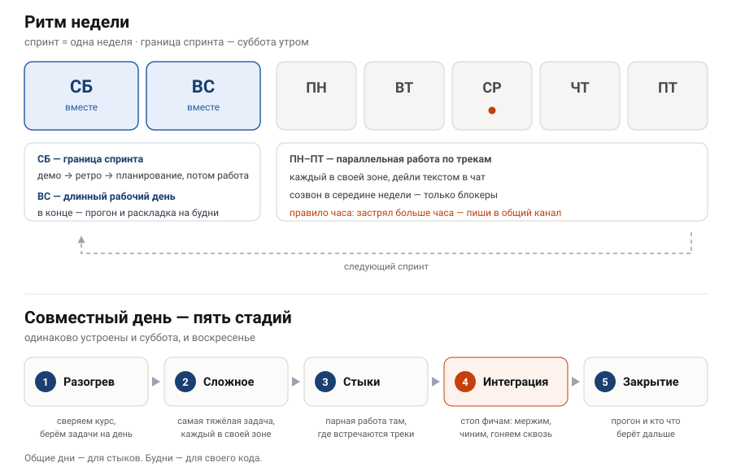

# WikiPulse — как мы работаем

Scrum с недельными спринтами. 4 спринта + полнедели буфера до защиты.

---

## Идея в трёх пунктах

**1. Контракт важнее реализации.**
Пока не согласована схема данных или формат ответа API — код по обе стороны
стыка не пишется. Как только согласован — обе стороны пишут параллельно и не
ждут друг друга. Контракты живут в [`docs/03-contracts/`](../03-contracts/),
меняются только через PR.

**2. Общие дни — для стыков, будни — для своего кода.**
Всё, что требует двух человек и живого обсуждения, планируется на выходные.
Всё, что делается в одиночку, — на будни. Если задача в будни требует соседа,
она спланирована неправильно.

**3. Каждый спринт заканчивается работающим инкрементом.**
Не «сделали 70% пайплайна», а «поток доезжает до карты». На демо показываем
запущенную систему с main, не слайды и не локальную ветку.

---

## Неделя

**Суббота** открывается границей спринта: смотрим демо того, что реально
работает, коротко разбираем процесс на ретро и планируем следующую неделю.
Дальше — рабочий день.

**Воскресенье** — сплошная работа без встреч. В конце дня прогоняем систему
целиком и вслух раскладываем задачи на будни: кто что берёт и от кого зависит.
Раскладка делается, пока все ещё вместе, — так зависимости находятся сразу.

**Будни** — параллельная работа по трекам. Каждый день короткий текстовый дейли
в чат (сделал / делаю / блокер) и один созвон в середине недели строго по
блокерам. Нет блокеров — созвон отменяется.

**Правило часа:** застрял больше чем на час — пиши в общий канал, не жди
созвона. Человек, который два дня молча ковырял чужую зону, — это минус два дня
из четырёх с половиной недель.

---

## Совместный день

Пять стадий, одинаково в субботу и воскресенье:

1. **Разогрев** — сверяем, где мы, и берём задачи на день.
2. **Сложное** — самая тяжёлая задача дня, пока голова свежая, каждый в своей
   зоне. Вопросы копим и задаём в перерыве, кроме блокеров.
3. **Стыки** — парная работа там, где два трека встречаются: пайплайн + бэкенд,
   бэкенд + фронт. Ради этого мы и собираемся вживую.
4. **Интеграция** — стоп новым фичам. Мержим, чиним CI, гоняем сквозной
   сценарий, разбираем накопленные вопросы.
5. **Закрытие** — прогон системы, обновление доски, кто что берёт дальше.

Уходим только когда main зелёный, а доска отражает реальность.

---

## Что держит систему

| Правило | Зачем |
|---|---|
| Один владелец на модуль, ревью — из соседнего трека | не спорим о решениях, но к защите каждый понимает соседа |
| Дежурный по интеграции, ротация каждую неделю | у зелёного CI есть конкретный ответственный |
| Не больше двух задач в работе на человека | если больше — оно висит, а не делается |
| Ветка живёт 1–2 дня | мержи в выходные не превращаются в разбор конфликтов |
| Решения пишем строкой в [`docs/04-decisions/`](../04-decisions/) | на защите спросят «почему так» |

---

## Спринты

| # | Цель | Демо показывает |
|---|---|---|
| 1 | Контракты и сквозной каркас на заглушках | фейковые события проходят весь путь и рисуются на карте |
| 2 | Реальный поток, справочник координат, джойн | настоящие правки в настоящих координатах |
| 3 | История, витрина, дашборд, UX карты | дашборд с аналитикой, карта похожа на продукт |
| 4 | **Фиче-фриз.** README, запуск с чистой машины, защита | полный прогон демо, дважды |

Три вещи, которые не двигаются:

- **Контракты фиксируем за три дня**, не за неделю: неделя — это 22% проекта.
- **Спайк по YTsaurus + SPYT — в первый же день.** Не запустилась стриминговая
  джоба к концу первых выходных — идём к менторам в понедельник.
- **Фиче-фриз с начала 4-й недели.** Защиту чаще проваливает несобирающийся
  `docker-compose`, чем нехватка фич.

---

## Задача готова, если

- код в main, CI зелёный;
- ревью от человека из соседнего трека пройдено;
- работает на чистом клоне через `docker-compose up`;
- если менялся контракт — обновлён [`docs/03-contracts/`](../03-contracts/)
  и затронутые уведомлены.

