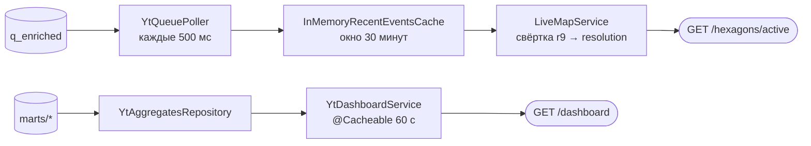

# Бэкенд: устройство REST-сервиса

Spring Boot между кластером YTsaurus и браузером. Отдаёт два экрана — живую
карту и дашборд — тремя эндпоинтами, ничего не пишет в кластер и не имеет
собственной базы.

Место бэкенда в системе и путь данных до него — в [pipeline.md](pipeline.md),
форматы ответов — в [../contracts/rest-api.md](../contracts/rest-api.md),
конфигурация — в [../runbooks/configuration.md](../runbooks/configuration.md).

## Стек

| Что | Версия | Зачем |
|---|---|---|
| Spring Boot | 4.1.0 | `spring-boot-starter-webmvc`, `-cache`, `-validation` |
| Java | 17 | целевой уровень компиляции |
| `ytsaurus-client` | 1.2.17 | RPC-клиент YTsaurus |
| `h3` (Uber) | 4.1.1 | вся геометрия ячеек |
| Caffeine | из BOM Spring | окно живой карты и кэш дашборда |
| Lombok | из BOM Spring | только `@Slf4j` |

Spring Boot 4 приносит **Jackson 3**: пакет реализации —
`tools.jackson.databind`, а не `com.fasterxml.jackson.databind`;
в `com.fasterxml` остались только аннотации.

## Слои

```
controller/   биндинг параметров, валидация границы доверия, делегирование
service/      бизнес-логика: свёртка H3, периоды, кэширование ответа
repository/   чтение YTsaurus и кэш свежих событий в памяти
service/poller/  наполнение кэша из очереди
model/, model/dto/  записи домена и записи ответа
error/        типы ошибок и единый обработчик
config/       бины H3Core, Clock, CacheManager
```

Контроллеры тонкие: разбирают параметры, проверяют их и зовут сервис.
Валидация `period` и `limit` живёт в `DashboardController`, а не в
реализациях `DashboardService`: это граница доверия, и дублировать её
в двух реализациях незачем.

## Два пути данных



**Карта не ходит в YT на запрос вообще**: данные уже лежат в памяти, их
положил туда фоновый поллер, и запрос стоит одну свёртку по кэшу. **Дашборд
ходит в YT**, но через кэш ответа на 60 секунд, поэтому в кластер уходит
не более одного чтения в минуту на пару `(period, limit)`. Данные разной
природы: окно в 30 минут помещается в память, агрегаты за месяц на лету
не считаются, но и меняются раз в час.

## Живая карта

### Поллер

`service/poller/YtQueuePoller.java`, `@Scheduled(fixedDelayString =
"${app.poller.interval-ms:500}")`.

Первый тик после старта вызывает `repository.skipToLatest()` — доходит до
конца очереди и ставит курсор туда, ничего не читая в кэш. Дальше каждый тик
читает страницами (до 10 страниц по 1000 строк) через
`QEnrichedRepository.fetchAfter`, пока в очереди есть непрочитанное.

Курсор двигается в `finally` — после страницы, независимо от того, что
случилось с отдельными событиями. Падение одного события ловится в `consume`,
событие отбрасывается и считается в `droppedEvents`, поток идёт дальше.
На ошибке чтения (`YtReadException`) курсор не двигается вовсе.

Логирование разведено по типам: `YtReadException` — `warn` и ретрай на
следующем тике, после пяти неудач подряд (`ytFailStreak`) сообщение
поднимается до `error`; любое другое `RuntimeException` — сразу `error`.

### Кэш свежих событий

`repository/InMemoryRecentEventsCache.java`, интерфейс `RecentEventsCache`:

```java
public interface RecentEventsCache {
    void put(EnrichedEvent event);

    Map<String, List<EnrichedEvent>> snapshot();
}
```

`put` вызывает только поллер, `snapshot` возвращает срез на момент вызова:
ключ — `h3_r9`, значение — события ячейки. Чтение идёт снимком, а не по
ключам, потому что карта сворачивает ключи кэша вверх и должна обойти все
ячейки.

- `ConcurrentHashMap<String, Deque<EnrichedEvent>>`, значение —
  `ConcurrentLinkedDeque`, новые события добавляются в начало;
- дедуп — отдельный Caffeine-кэш `seen` с `expireAfterWrite`, равным окну;
- окно считается по `event_ts` — времени самой правки в unix-секундах, а не
  времени чтения: если обогащение встало, карта пустеет, а не показывает
  старое как свежее;
- `snapshot()` собирает иммутабельную копию, отфильтровав протухшее и
  отсортировав каждую ячейку по времени;
- `@Scheduled(fixedDelay = 60_000)` раз в минуту чистит деки;
- потолка по размеру нет, размер ограничивает само окно.

Событие отбрасывается при записи, с записью в лог, в двух случаях:
`event_ts <= 0` (по нему нельзя посчитать окно) и `event_ts` больше текущего
времени более чем на `CLOCK_SKEW_SECONDS` (такое событие не протухло бы
никогда).

**Гарантии стыка** поллера и сервиса карты:

| Гарантирует запись | Может рассчитывать чтение |
|---|---|
| ключ — H3-индекс уровня 9, как пришёл из очереди | не проверяет формат ключа |
| в кэше нет правок старше 30 минут по `event_ts` | не фильтрует по времени |
| нет дублей по `event_id` | не дедуплицирует |
| коллекции иммутабельны, обход безопасен | не копирует защитно |
| ячейка без событий исчезает из снимка | не проверяет пустые списки |
| пустой кэш — пустая мапа | не проверяет на `null` |
| события отсортированы по `event_ts`, новые первыми | может обрезать длинные списки |
| событий без `event_ts` и «из будущего» нет | не проверяет время на осмысленность |

География, bbox и резолюции — не зона записи. Структура хранения, вытеснение
и выбор библиотеки — не зона чтения.

### Сборка ответа

`service/LiveMapService.java`, метод `active`:

1. проверка входа: `min` строго меньше `max` по обеим осям, `zoom`
   в диапазоне `app.live.zoom-min…zoom-max`;
2. `zoom` → резолюция H3 (`H3GeoService.resolutionZoom`, лестница —
   в [../runbooks/configuration.md](../runbooks/configuration.md));
3. `cache.snapshot()` — весь снимок окна;
4. каждый ключ r9 сворачивается **вверх** до целевой резолюции
   (`cellToParent`); невалидный ключ логируется и пропускается, а не роняет
   запрос;
5. ячейки, не пересекающиеся с экраном, отбрасываются;
6. для оставшихся собирается `HexagonDto`.

`H3GeoService.intersectsBbox` проверяет три условия, а не одно: центр ячейки
внутри прямоугольника, любая из шести вершин внутри прямоугольника, любой
из четырёх углов прямоугольника внутри ячейки. Третье условие нужно на
низком зуме, где экран целиком помещается в одну крупную ячейку.

`events_count` — размер ячейки **до** обрезки, а `events` — не более
`app.live.hexagon-events-cap` (50) самых свежих правок. Сортировка стоит
до `limit`, иначе в ответ попали бы первые 50 из конкатенации
отсортированных кусков, а не 50 самых свежих.

## Дашборд

`service/YtDashboardService.java` (профиль `yt`),
`repository/YtAggregatesRepository.java`.

Наружу периоды читаемые — `24h`, `7d`, `30d`, — а витрины хранят период
строкой в часах, поэтому сервис переводит: `7d` → `168h`, `30d` → `720h`.
Для `30d` 720 часовых точек сворачиваются в 30 суточных; `total_edits`
считается уже по свёрнутым точкам, поэтому сумма сходится с графиком.

Запросы к YT собираются строкой и уходят через `SelectRowsRequest`:

```sql
title, url, edits_count FROM [{marts/top_articles}]
WHERE period = "24h" ORDER BY rank LIMIT 10
```

Витрины — сортированные динамические таблицы с ключом `(period, rank)`,
поэтому такой запрос не сканирует таблицу целиком. Параметризованной
подстановки здесь нет, поэтому всё, что попадает в текст запроса,
проверяется до сборки строки: `period` — маской `^\d+h$`, `limit` —
зажимается в `1…1000`. Лимит по умолчанию для `trends` — 1000 точек, чуть
выше 720 часов самого длинного окна.

### Кэш ответа

`@Cacheable("dashboard")` на `YtDashboardService.getDashboard`, Caffeine
с `expireAfterWrite(60, SECONDS)` в `config/CacheConfig.java`. Кэшируется
**готовый ответ**, а не вызовы репозитория: иначе свёртка 720 точек
повторялась бы на каждый запрос. Побочная выгода — три витрины попадают
в кэш одним снимком, и блоки ответа гарантированно относятся к одному
чтению.

Ключ — пара `(period, limit)`. Без `limit` в ключе ответ на `limit=10`
вернулся бы и на запрос `limit=100`, и дашборд молча показал бы обрезанный
топ.

| Гарантирует кэш | Может рассчитывать сервис |
|---|---|
| ответ не старше 60 секунд | не проверяет свежесть |
| разные `period` и `limit` — разные записи | не смешивает результаты запросов |
| блоки ответа из одного чтения витрин | не сверяет их между собой |
| пустой список кэшируется как обычный ответ | не отличает «пусто» от «нет в кэше» |
| исключения не кэшируются | повторный запрос снова идёт в YT |

Аннотация стоит на реализации, а не на интерфейсе `DashboardService`:
`MockDashboardService` держит фикстуры в памяти, кэшировать в нём нечего.
При недоступности кластера пользователь получает 503, а не устаревшие
цифры.

## Ошибки

`error/GlobalExceptionHandler.java` — `@RestControllerAdvice`, унаследованный
от `ResponseEntityExceptionHandler`. Наследование обязательно: без него
`@ExceptionHandler(Exception.class)` перехватывает и стандартные исключения
Spring MVC, и 404 с 405 отдаются как 500.

| Исключение | Статус | Что видит клиент | Что уходит в лог |
|---|---|---|---|
| `BadRequestException` | 400 | наш собственный текст | — |
| `YtReadException` | 503 | `storage is temporarily unavailable` | полный стек с путём таблицы |
| прочее | 500 | `internal error` | полный стек |
| ошибки биндинга, 404, 405 | 4xx | обработка Spring MVC | — |

Формат — Problem Details (`spring.mvc.problemdetails.enabled: true`).
Наружу из ошибок YT уходит статичный текст: путь таблицы и сообщение
кластера остаются в логе.

## Профиль mock

Профиль `mock` показывает продукт целиком без кластера. `@Profile("yt")`
стоит на репозиториях, поллере и `YtDashboardService`; контроллеры от
профиля не зависят, поэтому контракт API одинаков в обоих режимах.

| Профиль `yt` | Профиль `mock` |
|---|---|
| `QEnrichedRepository`, `YtQueuePoller` | `MockPoller` |
| `YtAggregatesRepository`, `YtDashboardService` | `MockDashboardService` |

Данные — настоящие правки Википедии и настоящие витрины, снятые через
публичный API и сложенные в `backend/src/main/resources/fixtures/`.
`MockPoller` сдвигает выборку к текущему времени и гоняет её по кругу,
`MockDashboardService` читает фикстуры при старте и обрезает топы под
запрошенный `limit`.

**Ячейки в mock синтетические.** Координат правок в фикстурах нет, поэтому
ячейка назначается по хешу языкового раздела поверх настоящих `h3_parent`
из витрины: правка настоящая, ячейка настоящая, связь между ними — нет.

## Известные ограничения

1. **Одна реплика.** Кэш живой карты и курсор поллера живут в памяти
   процесса. Вторая реплика будет читать очередь независимо и держать свою
   копию окна: ответы разойдутся, нагрузка на очередь удвоится.
2. **Очередь читается `select_rows`, а не consumer API.** Курсор не
   переживает рестарт, читается только нулевой таблет, бэкенд не участвует
   в `auto_trim`.
3. **Свёртка идёт по всему снимку на каждый запрос.** Кэшируется окно,
   но не результат свёртки: два пользователя с одинаковым зумом и экраном
   оплачивают её дважды.
4. **Экран через 180-й меридиан не поддерживается.** Валидация требует
   `min_lng < max_lng`, так что viewport через антимеридиан получит 400.
5. **Текст ошибки про зум зашит константой** (`zoom must be between 0 and
   30`), хотя границы конфигурируемы.
6. **У каждого репозитория свой `YTsaurusClient`.** Два подключения к одному
   кластеру там, где хватило бы одного бина.
7. **Ключа `app.enrich.fetch-batch` в `application.yaml` нет** —
   `QEnrichedRepository` работает на дефолте `1000` из `@Value`.
