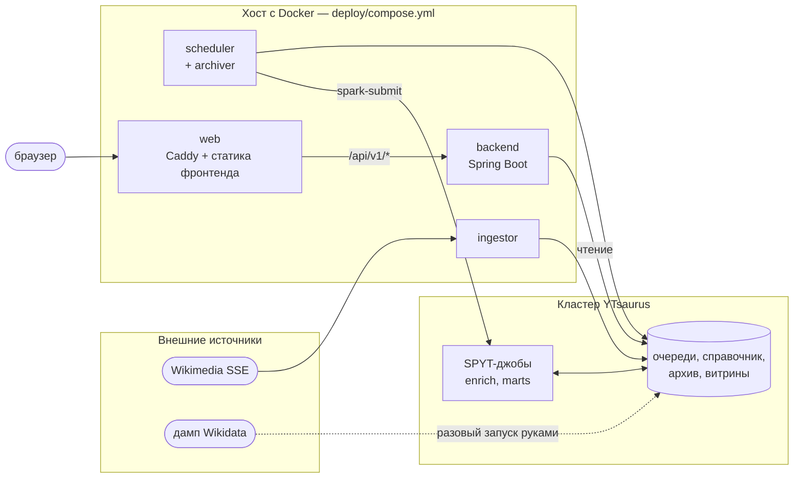
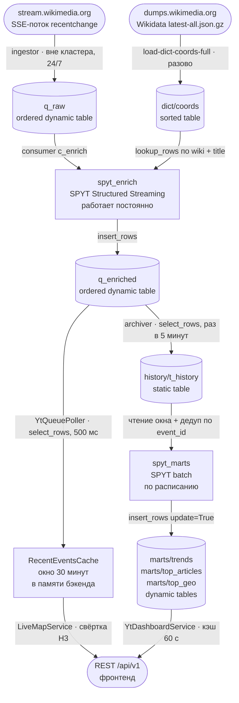

# Пайплайн: от потока правок Википедии до витрин

WikiPulse показывает правки Википедии на карте в реальном времени и считает
по ним историческую аналитику. Хранилище, вычисления и очереди — YTsaurus;
всё остальное вокруг него. Здесь описано, из чего система состоит, что
происходит с данными и какой примитив YTsaurus взят на каждом шаге.

Схемы таблиц — в [../contracts/yt-schemas.md](../contracts/yt-schemas.md),
устройство REST-сервиса — в [backend.md](backend.md), переменные окружения —
в [../runbooks/configuration.md](../runbooks/configuration.md).

## Компоненты

| Компонент | Каталог | Где выполняется | Роль |
|---|---|---|---|
| `ingestor` | `bigdata/` | контейнер на хосте | поток правок Википедии → очередь `q_raw` |
| `spyt_enrich` | `bigdata/` | операция на кластере | обогащение координатами, `q_raw` → `q_enriched` |
| `archiver` | `bigdata/` | подпроцесс шедулера | `q_enriched` → архив `history/t_history` |
| `spyt_marts` | `bigdata/` | операция на кластере | архив → витрины `marts/*` |
| `scheduler` | `bigdata/` | контейнер на хосте | запускает архиватор и витрины по расписанию |
| `backend` | `backend/` | контейнер на хосте | читает `q_enriched` и витрины, отдаёт REST |
| `frontend` | `frontend/` | браузер | карта и дашборд |
| `web` | `deploy/` | контейнер на хосте | Caddy: TLS, статика, прокси `/api` на бэкенд |

Разовые скрипты (`init-tables`, `upload-artifacts`, `load-dict-coords-full`)
живут там же, в `bigdata/`, но запускаются руками при развёртывании.

## Три границы

### 1. Пайплайн ↔ бэкенд: таблицы YTsaurus

Единственный способ, которым данные пайплайна попадают в сервис — таблицы.
HTTP-вызовов, очередей сообщений и общей базы между ними нет.

| Объект | Пишет | Читает |
|---|---|---|
| `{BASE}/q_enriched` | `spyt_enrich` | backend, `archiver` |
| `{BASE}/marts/trends` | `spyt_marts` | backend |
| `{BASE}/marts/top_articles` | `spyt_marts` | backend |
| `{BASE}/marts/top_geo` | `spyt_marts` | backend |

Общей типизации у сторон нет: совпадение имён и типов колонок держится
только на [контракте схем](../contracts/yt-schemas.md).

### 2. Бэкенд ↔ фронтенд: REST `/api/v1`

Три эндпоинта, JSON, поля в `snake_case`:

| Эндпоинт | Кто зовёт | Как часто |
|---|---|---|
| `GET /api/v1/hexagons/active` | карта | поллинг раз в 2,5 с |
| `GET /api/v1/dashboard` | дашборд | при открытии и смене периода |
| `GET /api/v1/config` | оболочка приложения | один раз при загрузке |

Форматы — [../contracts/rest-api.md](../contracts/rest-api.md).

Ключ Яндекс Карт приезжает фронту через `/api/v1/config`, в бандл он не
собирается: смена ключа — перезапуск бэкенда с другим `YMAPS_API_KEY`, а не
пересборка фронтенда. Пустой ключ допустим: фронт покажет экран ошибки
карты, остальное приложение работает.

Вся геометрия H3 остаётся на сервере, наружу уезжает готовый `h3_index`.

### 3. Всё ↔ кластер: `YT_BASE_PATH`

Литеральных путей к таблицам нет ни в бэкенде, ни в пайплайне. Корень
задаётся переменной `YT_BASE_PATH` (по умолчанию `//home/wikipulse`),
и от него строится всё остальное — в одном месте на модуль:

- пайплайн: `bigdata/src/bigdata/paths.py`;
- бэкенд: ключ `yt.base-path` в `application.yaml`, остальные пути через
  `${yt.base-path}/…`.

Форк проекта — это одна переменная окружения.

## Поток данных

Две ветки после `q_enriched` независимы: живая карта не ждёт архиватора,
дашборд не зависит от бэкенда. Очередь — единственная точка их встречи.

## Сквозной ключ `event_id`

Ингестор собирает идентификатор как `{wiki}|{revision.new}`. Номер ревизии
в Википедии уникален и неизменен, поэтому одна и та же правка получает один
и тот же `event_id` при любом числе повторных доставок — на этом держится
дедуп в кэше карты и `dropDuplicates(["event_id"])` в витринах.

## Шаг 1. SSE → `q_raw`

`bigdata/src/bigdata/jobs/ingestor.py`. Обычный python-процесс вне кластера,
сервис `ingestor` в `compose.yml`, работает постоянно.

Читает `https://stream.wikimedia.org/v2/stream/recentchange`, отбрасывает
всё, что не правка статьи (боты, служебные вики, ненулевые пространства
имён, типы кроме `edit` и `new`), нормализует заголовок и копит батч из
100 строк, который пишет одним `insert_rows(..., durability="sync")`.

**Примитив: очередь (ordered dynamic table).** Поток append-only и без
ключа, читатели идут каждый по своему смещению (у `q_enriched` их уже два),
запись сразу видна читателю, а ретеншен задаётся свойством объекта
`auto_trim`, а не отдельной джобой-чистильщиком.

## Шаг 2. Дамп Wikidata → `dict/coords`

`bigdata/src/bigdata/scripts/load_dict_coords_full.py`. Запускается руками
по мере устаревания дампа.

Стримит `latest-all.json.gz` не распаковывая на диск, отбирает сущности
с координатами (`P625`), разворачивает sitelinks в строки
`(wiki, title, lat, lon)`, пишет во временную таблицу батчами по 50 000
строк и сортирует её операцией кластера (`yt.run_sort`) в `dict/coords`.

**Примитив: статическая таблица, отсортированная по `(wiki, title)`.**
Справочник — снимок, а не поток. Сортировка нужна как условие точечного
чтения по ключу join.

**Ручной шаг после загрузки.** `dict/coords` остаётся статической, а
`lookup_rows` работает только со смонтированной динамической таблицей:
`alter_table(dynamic=True)` и `mount_table` вызываются руками, потому что
конверсия требует `unique_keys`, то есть уникальности пар `(wiki, title)`
на конкретном дампе. Шаг вынесен отдельным пунктом в `bigdata/README.md`.

## Шаг 3. `q_raw` + `dict/coords` → `q_enriched`

`bigdata/src/bigdata/jobs/spyt_enrich.py`. SPYT Structured Streaming,
`spark-submit --deploy-mode cluster`, работает постоянно, триггер 5 секунд.
Очередь читается через зарегистрированного консьюмера `consumers/c_enrich`,
смещения коммитит Spark в `{BASE}/checkpoints/c_enrich`.

Каждый микробатч собирается на драйвер, по парам `(wiki, title)` идёт
`lookup_rows` к справочнику, для найденных координат считается ячейка H3
уровня 9, результат пишется в `q_enriched` кусками по 50 000 строк.

**Join семантически inner.** Правка без координат в Wikidata в `q_enriched`
не попадает. Джоба печатает hit rate каждого батча — по нему видно, что
справочник устарел или не смонтирован.

## Шаг 4a. `q_enriched` → живая карта

`backend/.../repository/QEnrichedRepository.java`,
`backend/.../service/poller/YtQueuePoller.java`. Тик каждые 500 мс, до
10 страниц по 1000 строк, события кладутся в окно 30 минут в памяти
процесса. Дальше карта строится из кэша, без обращений к YT — подробности
в [backend.md](backend.md).

Очередь читается не консьюмером, а `select_rows` по служебным колонкам:
`WHERE [$tablet_index] = 0 AND [$row_index] > {cursor}`.

## Шаг 4b. `q_enriched` → `history/t_history`

`bigdata/src/bigdata/jobs/archiver.py`. Запускается шедулером раз в 5 минут,
читает страницами по 5000 строк тем же `select_rows`, дописывает их в архив
и записывает курсор.

**Примитив: статическая таблица + курсор в атрибуте Cypress**
(`history/t_history/@archiver_last_row_index`). Отдельного хранилища
состояния не нужно: у YTsaurus метаданные и данные живут в одном дереве.
Архив статический, потому что его читают только целиком и только батчем.

Два архиватора одновременно запускать нельзя — они гоняются за одним
курсором и плодят дубли. Поэтому в `compose.yml` отдельного сервиса
`archiver` нет: его запускает только шедулер.

## Шаг 5. `history/t_history` → `marts/*`

`bigdata/src/bigdata/jobs/spyt_marts.py`. SPYT batch, отрабатывает и
завершается. Читает архив, фильтрует окно `event_ts >= now - hours*3600`,
снимает дубли по `event_id` и считает три витрины:

| Витрина | Что считает | Ключ |
|---|---|---|
| `marts/trends` | правки по часовым бакетам | `bucket_ts` |
| `marts/top_articles` | топ статей окна | `period`, `rank` |
| `marts/top_geo` | топ ячеек H3, свёрнутых до `--h3-res` (по умолчанию 6) | `period`, `rank` |

**Примитив: сортированные динамические таблицы.** Витрины — единственные
таблицы проекта, которые читает пользовательский запрос синхронно; ключ
`(period, rank)` делает `WHERE period = "24h" ORDER BY rank LIMIT 10`
точечным чтением, а не сканом.

Запись — upsert по ключу, поэтому повторный запуск того же окна ничего не
ломает. Пустое окно витрины не трогает. Свежесть видна в Cypress: джоба
ставит `@computed_at`, `@window_hours`, а на топы — `@top_n` и `@h3_res`.

При равных `edits_count` сортировка добивается по `title` (или `h3_parent`),
поэтому топ не пляшет между пересчётами. Upsert не удаляет: после
уменьшения `--top-n` хвост старых рангов остаётся в витрине и чистится
руками.

## Очереди и консьюмеры

| Объект | Тип | Консьюмер | Кто двигает |
|---|---|---|---|
| `q_raw` | queue | `consumers/c_enrich`, vital | SPYT, через checkpoint стрима |
| `q_enriched` | queue | `consumers/c_archive`, vital | **никто** |

Консьюмеры создаются в `bigdata/src/bigdata/scripts/init_tables.py`.

## Ретеншен и `auto_trim`

Обе очереди получают `auto_trim_config = {"enable": True}`. Автотрим удаляет
из очереди строки, прочитанные **всеми vital-консьюмерами**. Отсюда два
следствия:

- очередь **без единого vital-консьюмера** формально удовлетворяет условию
  для любой строки — трим срезал бы всё сразу. Поэтому консьюмер
  регистрируется до включения автотрима, а не после;
- очередь с vital-консьюмером, который **не двигается**, не тримится вообще
  и растёт вечно.

Фактически `q_raw` тримится: `spyt_enrich` двигает `c_enrich` через
checkpoint. `q_enriched` не тримится: `c_archive` зарегистрирован, чтобы
очередь не срезали до прихода архиватора, но сам архиватор ходит по
`$row_index` и консьюмера не двигает.

У `history/t_history` и витрин ретеншена нет никакого. Витрины ограничены
сверху (`top_n` строк на период, часовые бакеты), архив растёт линейно
и навсегда.

## Семантика доставки

| Стык | Семантика | Чем обеспечена | Что чинит повторы |
|---|---|---|---|
| SSE → `q_raw` | at-least-once, с окном потери при рестарте процесса | реконнект по `Last-Event-ID` | `event_id` ниже по потоку |
| `q_raw` → `q_enriched` | at-least-once | checkpoint Spark, отсутствие `try/except` в `foreachBatch` | `event_id` ниже по потоку |
| `q_enriched` → кэш карты | **at-most-once** | курсор в памяти, сдвиг в `finally` | дедуп по `event_id` в кэше |
| `q_enriched` → `t_history` | at-least-once | запись страницы до записи курсора | `dropDuplicates` в витринах |
| `t_history` → `marts/*` | эффективно exactly-once | дедуп по `event_id` + upsert по ключу | — |

Единственное место, где событие может пропасть — ветка живой карты: та же
правка доедет до истории и витрин другим путём. Идемпотентность нигде не
держится на транзакциях через несколько объектов, везде работает один приём:
естественный ключ плюс запись по ключу.

## Что работает постоянно, а что по расписанию

| Процесс | Где | Режим | Период |
|---|---|---|---|
| `ingestor` | контейнер вне кластера | постоянно | — |
| `spyt_enrich` | операция на кластере | постоянно | триггер 5 с |
| `YtQueuePoller` | внутри бэкенда | постоянно | 500 мс |
| вытеснение кэша карты | внутри бэкенда | постоянно | 60 с |
| `archiver` | подпроцесс шедулера | по расписанию | 5 мин |
| `spyt_marts --hours 24` | операция на кластере | по расписанию | 5 мин |
| `spyt_marts --hours 168`, `--hours 720` | операция на кластере | по расписанию | 1 час |
| `init-tables`, `upload-artifacts` | руками | разово при развёртывании | — |
| `load-dict-coords-full` | руками | по мере устаревания дампа | — |

Шедулер (`bigdata/src/bigdata/jobs/scheduler.py`) — цикл в контейнере,
а не cron. У каждого шага таймаут 30 минут, упавший шаг логируется и не
мешает следующему; отставание не накапливается — пропущенные тики
пропускаются.

## Что произойдёт при падении звена

| Упало | Что видит пользователь | Что происходит с данными | Восстановление |
|---|---|---|---|
| SSE Wikimedia | карта пустеет за 30 минут, дашборд не меняется | новых правок нет | реконнект через 5 с, правки за простой потеряны |
| `ingestor` | то же | `q_raw` не пополняется | рестарт контейнера; начинает с текущего конца потока |
| `spyt_enrich` | карта пустеет за 30 минут, витрины перестают расти | `q_raw` копится, автотрим её не режет | перезапуск `spark-submit`; чтение продолжится с checkpoint |
| `dict/coords` не смонтирована или устарела | карта пустая или редеет | правки без координат отбрасываются inner-join | hit rate в логе enrich падает до нуля; смонтировать или перезалить |
| YTsaurus недоступен | карта замирает на последних 30 минутах, дашборд отдаёт 503 | ингестор ретраит, enrich падает и повторяет батч | автоматически, данные не теряются |
| тик `YtQueuePoller` | карта не обновляется | ничего, очередь не трогается | следующий тик через 500 мс |
| бэкенд перезапущен | карта пуста, наполняется заново до 30 минут | ничего | автоматически, курсор ставится на конец очереди |
| `archiver` | дашборд отстаёт | `q_enriched` растёт, курсор на месте | следующий цикл шедулера; дубли снимут витрины |
| `spyt_marts` | дашборд показывает прошлый пересчёт | витрины не обнуляются | следующий цикл; `@computed_at` покажет свежесть |
| `scheduler` | дашборд замирает, карта живёт | `q_enriched` растёт | рестарт контейнера |
| фронтенд | — | ничего | бэкенд stateless по HTTP |

Падение любой ветки после `q_enriched` не влияет на другую, а падение чего
угодно на кластере не роняет ингестор. Безвозвратен простой одного звена —
самого источника.

## Текущие ограничения

1. **Бэкенд читает `q_enriched` через `select_rows`, а не consumer API.**
   Курсор в памяти, рестарт теряет позицию, читается только нулевой таблет,
   бэкенд не участвует в триме.
2. **`spyt_enrich` работает на драйвере.** `collect()`, `lookup_rows`
   и `insert_rows` идут из одного процесса; потолок — его пропускная
   способность.
3. **`compute_top_geo` собирает уникальные ячейки окна на драйвер** ради
   `cell_to_parent`; за 30 дней их могут быть сотни тысяч.
4. **Архиватор не двигает `c_archive`**, поэтому `q_enriched` не тримится.
5. **`dict/coords` не переводится в динамическую автоматически** — ручной
   шаг перед первым запуском обогащения.
6. **У `history/t_history` нет ретеншена.**
7. **Шедулер без персистентного состояния**: перезапуск сбрасывает таймер
   медленных окон, параллельный запуск он не различает.
8. **`Last-Event-ID` ингестора хранится только в памяти**: перезапуск
   процесса начинает чтение с текущего конца потока.
